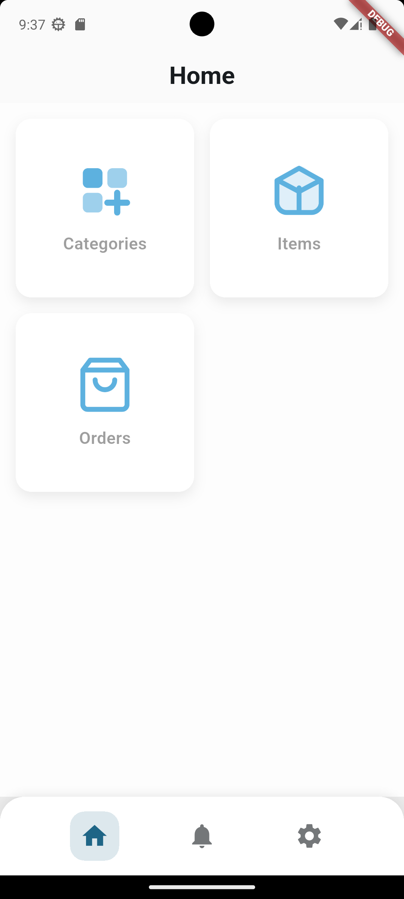
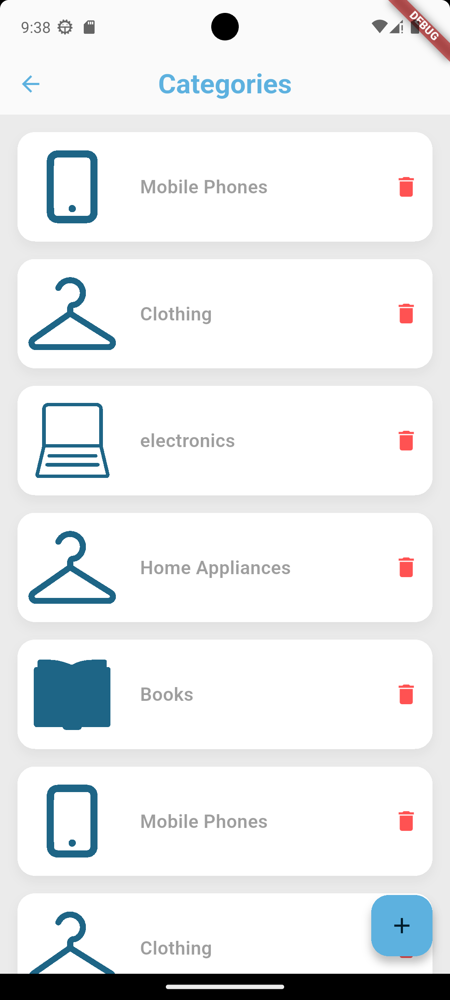
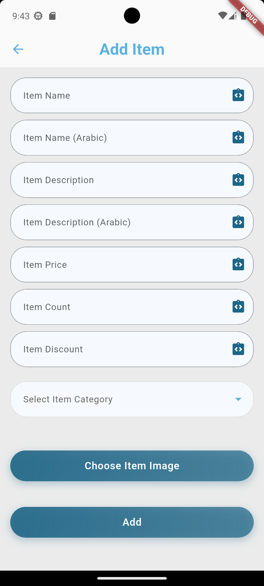

# Ecommerce Admin App (Flutter)

Admin dashboard application for managing the ecommerce system.

## Features
- Admin authentication
- Manage products
- View and manage orders
- System overview

## Tech Stack
- Flutter
- Dart
- REST API
- GetX

## Screenshots

## Related Repositories
- Backend API:[link](https://github.com/osamajmt/ecommerce-api-laravel)
- Driver App: [link](https://github.com/osamajmt/ecommerce-customer-flutter)
- Admin App: [link](https://github.com/osamajmt/ecommerce-delivery-flutter)